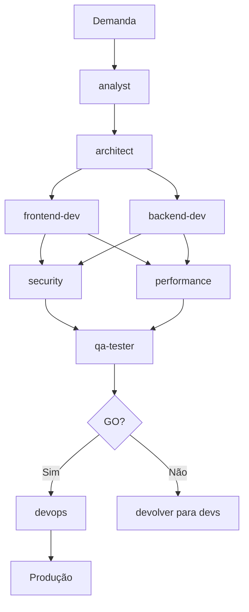

# AI Factory

Estrutura para operar com agentes, skills e workflows em qualquer IDE (Claude Code, Cursor, Copilot, etc).

## 🚀 Quick Start

1. **Leia o ORCHESTRATOR.md** - Entenda o fluxo
2. **Verifique PROJECT_CONTEXT.md** - Qual a fase atual?
3. **Assuma o agente da fase** - Leia `.ai-factory/agents/{agente}.md`
4. **Execute com base nas responsabilidades** - Siga o checklist do agente
5. **Registre handoff** - Atualize `PROGRESS.md`

## 📁 Estrutura

```
.ai-factory/
├── ORCHESTRATOR.md         # Como usar esta estrutura
├── PROJECT_CONTEXT.md      # Contexto do projeto (EDITAR)
├── PROGRESS.md             # Registro de progresso
├── factory.config.yml      # Configurações globais
│
├── agents/                 # Definições de agentes especializados
│   ├── product-owner.md
│   ├── analyst.md
│   ├── architect.md
│   ├── frontend-dev.md
│   ├── backend-dev.md
│   ├── security.md
│   ├── performance.md
│   ├── qa-tester.md
│   └── devops.md
│
├── skills/                 # Habilidades transversais
│   ├── code-review.md
│   ├── api-design.md
│   ├── database-design.md
│   ├── testing.md
│   └── debugging.md
│
├── standards/              # Padrões obrigatórios
│   ├── code-style.md
│   ├── architecture.md
│   ├── security-rules.md
│   └── testing-policy.md
│
├── workflows/              # Fluxos de trabalho
│   ├── discovery.yml
│   ├── new-feature.yml
│   ├── bugfix.yml
│   └── release.yml
│
├── handoffs/               # Regras de transição
│   ├── definition-of-ready.md
│   ├── definition-of-done.md
│   └── transition-rules.md
│
├── prompts/                # Prompts reutilizáveis
│   └── templates/
│
├── checklists/             # Checklists de qualidade
│   ├── pr-checklist.md
│   └── release-checklist.md
│
└── templates/              # Templates de artefatos
    └── artifacts/
```

## 🎯 Como Usar em Cada IDE

### Claude Code / Claude Desktop
```bash
# Comando inicial
Leia .ai-factory/ORCHESTRATOR.md
Leia .ai-factory/PROJECT_CONTEXT.md
Qual a fase atual? Assuma o agente correspondente.
```

### Cursor
```
@.ai-factory/ORCHESTRATOR.md
@.ai-factory/PROJECT_CONTEXT.md
@.ai-factory/agents/{agente}.md
```

### GitHub Copilot
```
#AI Factory: Leia .ai-factory/PROJECT_CONTEXT.md 
# e atue como o agente da fase atual
```

### VS Code + Extensions
1. Abra `.ai-factory/PROJECT_CONTEXT.md`
2. Verifique "agente atual"
3. Leia `.ai-factory/agents/{agente}.md`
4. Execute tarefas conforme responsabilidades

## 🔄 Workflow Padrão (New Feature)



## 📋 Regras de Ouro

1. **Contexto primeiro** - Sempre leia PROJECT_CONTEXT.md antes de começar
2. **Um agente por vez** - Não misture responsabilidades
3. **Handoff explícito** - Nunca pule etapas, sempre registre
4. **Checklist obrigatório** - Cada agente tem seu checklist
5. **Devolução é normal** - Security/Performance/QA podem devolver trabalho
6. **Rastreabilidade** - Tudo deve estar em PROGRESS.md

## 🚨 Red Flags

- ❌ Pular etapa de análise ou arquitetura
- ❌ Handoff sem checklist completo
- ❌ Código sem testes
- ❌ Secrets no código
- ❌ Deploy sem aprovação do QA
- ❌ Ignorar standards

## 📚 Documentação Adicional

- **Agents:** Definições de papéis e responsabilidades
- **Skills:** Habilidades que qualquer agente pode usar
- **Standards:** Regras que TODOS devem seguir
- **Workflows:** Fluxos para diferentes cenários
- **Handoffs:** Como transferir responsabilidades

---

**Próxima ação:** Leia `ORCHESTRATOR.md` para entender o fluxo completo.