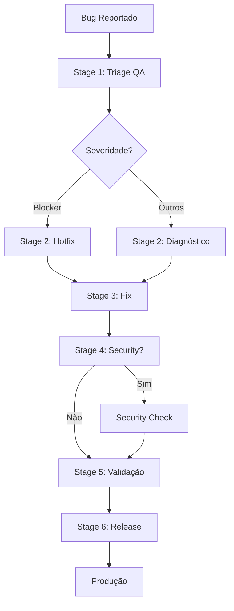

# Workflow: Correção de Bug

## Trigger
Bug reportado (produção ou QA)

---

## Stage 1 - Triage
**Agente:** qa-tester

**Tarefas:**
1. Reproduzir bug
2. Classificar severidade (Blocker, Crítico, Maior, Menor)
3. Documentar em `BUG-ID.md`

**Gate:**
- [ ] Bug reproduzível com passos claros

**Routing:**
- **Blocker** → Fluxo expresso (hotfix)
- **Demais** → Fluxo normal

---

## Stage 2 - Diagnóstico
**Agente:** backend-dev ou frontend-dev (conforme área)

**Tarefas:**
1. Identificar causa raiz (não só sintoma)
2. Avaliar impacto (quais funcionalidades afetadas)
3. Estimar esforço de correção

**Gate:**
- [ ] Causa raiz identificada

---

## Stage 3 - Fix
**Agente:** backend-dev ou frontend-dev

**Tarefas:**
1. Escrever teste que reproduz o bug (deve falhar)
2. Implementar correção (teste deve passar)
3. Rodar regressão (suite completa)

**Gate:**
- [ ] Teste de regressão adicionado
- [ ] Suite completa passando
- [ ] Sem mudanças fora do escopo

---

## Stage 4 - Security Check (condicional)
**Agente:** security

**Condição:** Bug relacionado a auth, permissões ou dados

**Tarefas:**
1. Revisar se bug era explorável
2. Verificar variantes do mesmo bug
3. Validar correção de segurança

---

## Stage 5 - Validação
**Agente:** qa-tester

**Tarefas:**
1. Validar correção em staging
2. Executar smoke suite
3. Verificar se bug não reproduz mais

**Gate:**
- [ ] Bug não reproduz
- [ ] Smoke OK

---

## Stage 6 - Release
**Agente:** devops

### Hotfix (bug blocker em produção)
- Deploy imediato com aprovação
- Branch a partir de `main` ou produção
- Fix mínimo possível (nada além do bug)
- Review expresso (1 aprovador sênior)
- Deploy com monitoramento intensivo (1 hora)
- Backport para `develop`
- Post-mortem (sem culpados) em 48 horas

### Normal
- Entra no próximo release programado

---

## Regras de Hotfix

### Quando Usar
- Bug **blocker** em produção
- Impacto crítico em usuários
- Vazamento de dados
- Perda de receita

### Processo
```
1. Criar branch da main: hotfix/BUG-001-descricao
2. Implementar fix mínimo
3. Teste que reproduz o bug + correção
4. Review expresso (1 sênior)
5. Deploy em produção
6. Monitorar 1 hora
7. Backport para develop
8. Post-mortem em 48h
```

### Post-Mortem (sem culpados)
- O que aconteceu?
- Por que aconteceu?
- Como prevenir?
- Ações concretas

---

## Matriz de Severidade

| Severidade | Impacto | SLA | Fluxo |
|------------|---------|-----|-------|
| **Blocker** | Sistema indisponível, perda de dados | 1 hora | Hotfix |
| **Crítico** | Funcionalidade principal quebrada | 4 horas | Hotfix |
| **Maior** | Funcionalidade secundária quebrada | 1 dia | Normal |
| **Menor** | Incômodo, não bloqueia uso | 1 semana | Backlog |

---

## Visualização do Fluxo

