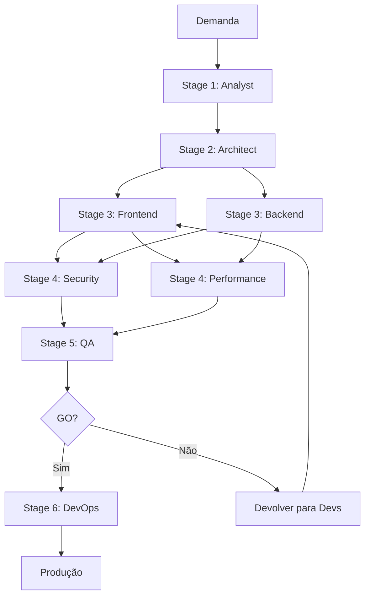

# Workflow: Nova Feature

## Trigger
Demanda de nova funcionalidade

## Stage 1 - Analysis
**Agente:** analyst

**Input:**
- descricao da demanda
- contexto de negócio
- product-goals.md (se existir)

**Output:**
- docs/analysis/requirements.md
- docs/analysis/user-stories.md
- docs/analysis/acceptance-criteria.md

**Gate:**
- [ ] Checklist do analyst 100%
- [ ] Aprovação do stakeholder

**Se falhar:** Refinar com stakeholder

---

## Stage 2 - Architecture
**Agente:** architect

**Input:**
- docs/analysis/*

**Output:**
- docs/architecture/architecture-design.md
- docs/architecture/api-design.md
- docs/adr/ADR-*.md

**Gate:**
- [ ] Checklist do architect 100%
- [ ] ADRs para decisões principais

**Se falhar:** Revisar com analyst (requisitos insuficientes)

---

## Stage 3 - Development (PARALELO)

### Frontend
**Agente:** frontend-dev

**Input:**
- docs/design/* (se existir)
- docs/analysis/user-stories.md
- docs/architecture/api-design.md

**Output:**
- frontend/src/**
- frontend/tests/**

**Gate:**
- [ ] Cobertura > 70%
- [ ] Build OK
- [ ] Lint OK

### Backend
**Agente:** backend-dev

**Input:**
- docs/architecture/*
- docs/analysis/business-rules.md

**Output:**
- backend/src/**
- backend/tests/**
- backend/openapi.yaml

**Gate:**
- [ ] Cobertura > 80%
- [ ] Migrations OK
- [ ] Swagger atualizado

### Sync Point
**Contratos de API validados entre front e back**

---

## Stage 4 - Quality Audit (PARALELO)

### Security
**Agente:** security

**Output:**
- docs/security/security-report.md

**Gate:**
- [ ] Zero vulnerabilidades CRÍTICAS
- [ ] Zero vulnerabilidades ALTAS

**Se falhar:** Devolver para Stage 3 com `remediation-plan.md`

### Performance
**Agente:** performance

**Output:**
- docs/performance/performance-report.md
- docs/performance/load-test-results.md

**Gate:**
- [ ] Budgets atingidos

**Se falhar:** Devolver para Stage 3 com `optimization-plan.md`

---

## Stage 5 - Testing
**Agente:** qa-tester

**Input:**
- Aplicação em staging
- docs/analysis/acceptance-criteria.md

**Output:**
- docs/qa/qa-report.md
- e2e/**

**Gate:**
- [ ] Zero bugs blocker e críticos
- [ ] 100% critérios validados

**Se falhar:** Devolver para Stage 3 com `bug-reports/`

---

## Stage 6 - Release
**Agente:** devops

**Input:**
- docs/qa/qa-report.md (deve ser GO)

**Output:**
- Deploy em produção
- Release notes

**Gate:**
- [ ] Smoke test pós-deploy OK
- [ ] Métricas estáveis por 30min

**Se falhar:** Rollback automático + post-mortem

---

## Pós-Release
- [ ] Atualizar `PROGRESS.md`
- [ ] Atualizar `PROJECT_CONTEXT.md`
- [ ] Retrospectiva: o que melhorar no processo

## Visualização do Fluxo

