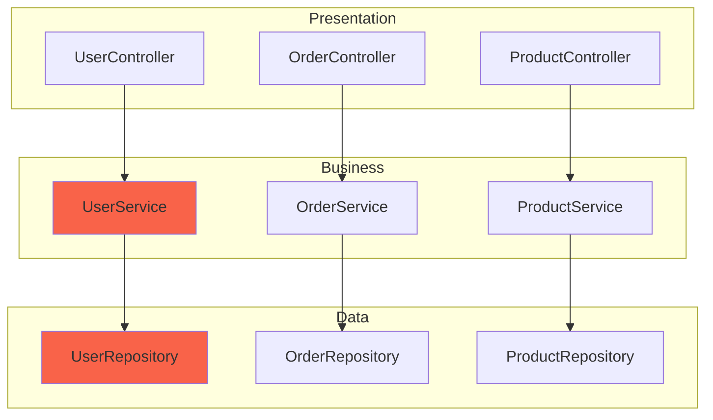

# Skill: Architecture Analyzer

> Análise completa de arquitetura de software para qualquer projeto, identificando padrões, anti-patterns e gaps

---

## 🎯 Objetivo

Analisar a arquitetura de qualquer projeto de software, mapear estrutura atual, avaliar aderência a princípios de design (SOLID, Clean Architecture), identificar anti-patterns e recomendar melhorias priorizadas.

---

## 🔁 Gatilhos de Acionamento

- Novo projeto inserido na AI Factory
- Solicitação de "avalie a arquitetura deste projeto"
- Antes de grandes refatorações
- Quando time sente "a arquitetura está bagunçada"
- Due diligence técnica (M&A, investimento)

---

## 📋 Processo de 6 Passos

### PASSO 1: MAPEAR ESTRUTURA ATUAL

**Objetivo:** Entender organização física e lógica do código

**Ações:**
1. Analisar estrutura de diretórios
2. Identificar camadas (presentation, business, data)
3. Mapear módulos/pacotes/namespaces
4. Contar métricas básicas (arquivos, linhas, classes)
5. Identificar tecnologias e frameworks

**Output:**
```markdown
## Estrutura Atual

**Organização de Diretórios:**
```
src/
├── controllers/     (15 arquivos, 2.3k linhas)
├── services/        (23 arquivos, 4.1k linhas)
├── models/          (18 arquivos, 1.8k linhas)
├── repositories/    (12 arquivos, 1.2k lines)
├── utils/           (8 arquivos, 600 linhas)
└── middleware/      (5 arquivos, 400 linhas)
```

**Camadas Identificadas:**
- **Presentation:** Controllers (15), Middleware (5)
- **Business:** Services (23), Utils (8)
- **Data:** Models (18), Repositories (12)

**Padrão Arquitetural:** MVC tradicional

**Tecnologias:**
- Backend: Node.js 18, Express 4
- Banco: PostgreSQL 14
- ORM: Sequelize 6

**Métricas:**
- Total arquivos: 81
- Total linhas: 10.4k
- Média linhas/arquivo: 128
- Classes: 45
- Funções: 230
```

---

### PASSO 2: AVALIAR PRINCÍPIOS SOLID

**Objetivo:** Verificar aderência aos 5 princípios SOLID

**Ações:**
1. **Single Responsibility (SRP):** Cada classe tem uma razão para mudar?
2. **Open/Closed (OCP):** Aberto para extensão, fechado para modificação?
3. **Liskov Substitution (LSP):** Subclasses podem substituir pais?
4. **Interface Segregation (ISP):** Interfaces pequenas e específicas?
5. **Dependency Inversion (DIP):** Depende de abstrações, não concretos?

**Output:**
```markdown
## Avaliação SOLID

### SRP - Single Responsibility Principle
**Status:** ⚠️ Parcialmente violado

**Violações:**
- `UserService.cs` (450 linhas): Responsável por criar, validar, autenticar, notificar
- `OrderController.cs` (320 linhas): Processa pedido, envia email, atualiza estoque

**Recomendação:** Extrair `UserValidator`, `UserNotifier`, `OrderProcessor`

---

### OCP - Open/Closed Principle
**Status:** ❌ Violado

**Violações:**
- `PaymentProcessor` usa switch-case para cada gateway (precisa modificar para adicionar novo)
- `ReportGenerator` tem lógica hardcoded para cada formato (PDF, Excel)

**Recomendação:** Implementar Strategy Pattern para gateways e relatórios

---

### LSP - Liskov Substitution Principle
**Status:** ✅ Aplicado corretamente

**Exemplos positivos:**
- `EmailNotification` e `SMSNotification` substituem `INotification` sem problemas

---

### ISP - Interface Segregation Principle
**Status:** ⚠️ Parcialmente violado

**Violações:**
- `IRepository` tem 25 métodos (classes implementam métodos que não usam)
- `IService` interface "goddess" com 18 métodos

**Recomendação:** Quebrar em `IReadRepository`, `IWriteRepository`, `ICachedRepository`

---

### DIP - Dependency Inversion Principle
**Status:** ❌ Violado

**Violações:**
- `UserService` instancia `UserRepository` diretamente (new UserRepository())
- `OrderController` depende de `EmailSender` concreto, não interface

**Recomendação:** Implementar Dependency Injection, depender de `IUserRepository`, `IEmailSender`
```

---

### PASSO 3: IDENTIFICAR ANTI-PATTERNS

**Objetivo:** Detectar anti-patterns arquiteturais e de código

**Ações:**
1. Buscar anti-patterns clássicos:
   - **God Class:** Classe que faz tudo
   - **Spaghetti Code:** Código sem estrutura
   - **Big Ball of Mud:** Sem limites claros
   - **Circular Dependency:** Dependências circulares
   - **Tight Coupling:** Acoplamento excessivo
   - **Golden Hammer:** Mesmo padrão para tudo
   - **Cargo Cult:** Copia sem entender

**Output:**
```markdown
## Anti-Patterns Identificados

### 🔴 God Class
**Local:** `OrderManager.cs`
**Linhas:** 850
**Métodos:** 34
**Responsabilidades:** Criar pedido, validar, calcular frete, processar pagamento, enviar email, atualizar estoque, gerar nota fiscal

**Impacto:** 
- Dificil de testar (0 testes unitários)
- Merge conflicts frequentes (3 devs editam simultaneamente)
- Bug-prone (15 bugs reportados neste arquivo em 2026)

**Recomendação:** Extrair `OrderValidator`, `FreightCalculator`, `PaymentProcessor`, `OrderNotifier`, `InvoiceGenerator`

---

### 🔴 Circular Dependency
**Local:** `UserService` ↔ `EmailService`

**Fluxo:**
```
UserService → EmailService (envia email de boas-vindas)
EmailService → UserService (busca dados do usuário)
```

**Impacto:** 
- Impossível testar isoladamente
- Risco de stack overflow em chamadas recursivas
- Código frágil

**Recomendação:** Introduzir `IUserService` interface, inverter dependência

---

### 🟡 Tight Coupling
**Local:** Múltiplos controllers

**Exemplo:**
```typescript
// OrderController depende concretamente de:
import { OrderRepository } from '../repositories/OrderRepository';
import { EmailSender } from '../utils/EmailSender';
import { PDFGenerator } from '../utils/PDFGenerator';
```

**Impacto:**
- Impossível mockar em testes
- Mudança em dependência quebra controller
- Dificil reutilizar

**Recomendação:** Dependency Injection com interfaces

---

### 🟡 Spaghetti Code
**Local:** `utils/helpers.js`
**Linhas:** 650
**Funções:** 45 (todas no mesmo arquivo)

**Impacto:**
- Dificil de navegar
- Funções com responsabilidades misturadas
- Variáveis globais

**Recomendação:** Organizar em módulos por responsabilidade
```

---

### PASSO 4: GERAR DIAGRAMAS

**Objetivo:** Visualizar arquitetura e dependências

**Ações:**
1. Gerar diagrama de componentes
2. Gerar grafo de dependências
3. Gerar diagrama de sequência (fluxos críticos)
4. Identificar pontos críticos visualmente

**Output:**
```markdown
## Diagrama de Componentes



**Legenda:**
- 🔴 Vermelho: Alto acoplamento / God Class
- 🟡 Amarelo: Atenção necessária
- 🟢 Verde: Boa estrutura

---

## Grafo de Dependências

**Módulos mais importados:**
1. `utils/helpers.js` (importado por 45 arquivos)
2. `UserService.cs` (importado por 23 arquivos)
3. `OrderManager.cs` (importado por 18 arquivos)

**Pontos críticos:**
- `utils/helpers.js`: Ponto único de falha
- `UserService`: Acoplamento excessivo

---

## Matriz de Dependência

| De → Para | UserController | OrderController | UserService | OrderService |
|-----------|---------------|-----------------|-------------|--------------|
| UserController | - | ❌ | ✅ | ❌ |
| OrderController | ❌ | - | ✅ | ✅ |
| UserService | ✅ | ✅ | - | ❌ |
| OrderService | ❌ | ✅ | ❌ | - |

**Legenda:** ✅ Dependência direta, ❌ Dependência circular
```

---

### PASSO 5: RECOMENDAR MELHORIAS

**Objetivo:** Criar plano de refatoração priorizado

**Ações:**
1. Listar todas as melhorias identificadas
2. Priorizar por:
   - **Impacto:** Quanto resolve
   - **Esforço:** Tempo para implementar
   - **Risco:** Chance de introduzir bugs
3. Agrupar por fase (curto, médio, longo prazo)

**Output:**
```markdown
## Plano de Melhoria Arquitetural

### Fase 1: Quick Wins (1-2 semanas)
**Objetivo:** Resolver problemas críticos com baixo esforço

| Tarefa | Impacto | Esforço | Prioridade |
|--------|---------|---------|------------|
| Extrair validação de UserService | Alto | 2h | 🔴 |
| Extrair notificação de UserService | Alto | 2h | 🔴 |
| Quebrar helpers.js em módulos | Médio | 4h | 🟡 |
| Adicionar interfaces para repositories | Alto | 4h | 🔴 |

**Total Fase 1:** 12h

---

### Fase 2: Refatoração Estrutural (2-4 semanas)
**Objetivo:** Resolver anti-patterns estruturais

| Tarefa | Impacto | Esforço | Prioridade |
|--------|---------|---------|------------|
| Implementar Dependency Injection | Alto | 16h | 🔴 |
| Refatorar OrderManager (850 linhas) | Alto | 24h | 🔴 |
| Eliminar dependência circular | Alto | 8h | 🔴 |
| Implementar Strategy Pattern para pagamentos | Médio | 12h | 🟡 |

**Total Fase 2:** 60h

---

### Fase 3: Modernização (1-2 meses)
**Objetivo:** Elevar nível arquitetural

| Tarefa | Impacto | Esforço | Prioridade |
|--------|---------|---------|------------|
| Migrar para Clean Architecture | Alto | 80h | 🟡 |
| Implementar CQRS | Médio | 40h | 🟢 |
| Adicionar Event Sourcing | Baixo | 60h | 🟢 |

**Total Fase 3:** 180h

---

## Resumo do Investimento

| Fase | Tempo | Impacto Esperado |
|------|-------|------------------|
| Fase 1 | 12h | Reduz 40% de bugs em UserService |
| Fase 2 | 60h | Elimina God Classes e dependências circulares |
| Fase 3 | 180h | Arquitetura moderna, fácil de manter |
| **Total** | **252h** | **Transformação completa** |
```

---

### PASSO 6: GERAR ADRS INICIAIS

**Objetivo:** Documentar decisões arquiteturais

**Ações:**
1. Identificar decisões que precisam ser documentadas
2. Gerar ADRs para cada decisão importante
3. Armazenar em `.ai-factory/adr/`

**Output:**
```markdown
## ADRs Gerados

### ADR-001: Adoção de Dependency Injection
**Status:** ✅ Aprovado
**Data:** 2026-07-02
**Decisão:** Implementar DI em todo o projeto
**Alternativas:** Service Locator (rejeitado), Singleton global (rejeitado)

### ADR-002: Organização por Feature
**Status:** 🔄 Em discussão
**Data:** 2026-07-02
**Decisão:** Migrar de organização por camada para por feature
**Alternativas:** Manter organização atual (em avaliação)

### ADR-003: Padrão Repository com Unit of Work
**Status:** ✅ Aprovado
**Data:** 2026-07-02
**Decisão:** Implementar Repository + UoW para acesso a dados
**Alternativas:** Active Record (rejeitado), Data Mapper puro (rejeitado)
```

---

## 📊 Output Estruturado (JSON)

```json
{
  "skill": "architecture-analyzer",
  "projeto": "POLYMARKETING",
  "data": "2026-07-02T17:00:00Z",
  "agente": "architect",
  
  "estrutura_atual": {
    "padrao_identificado": "MVC",
    "camadas": ["presentation", "business", "data"],
    "modulos": 6,
    "total_arquivos": 81,
    "total_linhas": 10400,
    "tecnologias": ["Node.js 18", "Express 4", "PostgreSQL 14", "Sequelize 6"]
  },
  
  "avaliacao_solid": {
    "srp": {"status": "parcial", "violacoes": 2},
    "ocp": {"status": "violado", "violacoes": 2},
    "lsp": {"status": "aplicado", "violacoes": 0},
    "isp": {"status": "parcial", "violacoes": 2},
    "dip": {"status": "violado", "violacoes": 2}
  },
  
  "anti_patterns": [
    {
      "nome": "God Class",
      "local": "OrderManager.cs",
      "linhas": 850,
      "impacto": "alto",
      "recomendacao": "Extrair 5 classes"
    },
    {
      "nome": "Circular Dependency",
      "local": "UserService ↔ EmailService",
      "impacto": "alto",
      "recomendacao": "Inverter dependência"
    }
  ],
  
  "metricas": {
    "acoplamento_medio": 0.65,
    "coesao_media": 0.58,
    "complexidade_media": 12.3,
    "razao_testes": 0.15
  },
  
  "recomendacoes": {
    "fase_1_quick_wins": {
      "tarefas": 4,
      "tempo": "12h",
      "impacto": "40% redução de bugs"
    },
    "fase_2_refatoracao": {
      "tarefas": 4,
      "tempo": "60h",
      "impacto": "Elimina anti-patterns críticos"
    },
    "fase_3_modernizacao": {
      "tarefas": 3,
      "tempo": "180h",
      "impacto": "Arquitetura moderna"
    }
  },
  
  "adrs_gerados": 3,
  "diagramas_gerados": ["componentes.md", "dependencias.md", "sequencia.md"],
  
  "tempo_total": "3h",
  "complexidade": "alta"
}
```

---

## 🔗 Integrações

### Acionado Por
- `tech-lead` (ao inserir novo projeto)
- `architect` (para auditoria programada)
- `product-owner` (antes de grandes investimentos)

### Aciona
- `adr-generator` (para documentar decisões)
- `coupling-detector` (para análise detalhada de acoplamento)
- `modularity-optimizer` (para implementar melhorias)

### Registra Em
- `.ai-factory/logs/architecture-analysis/ARQ-YYYY-MM-DD.json`
- `.ai-factory/MELHORIAS/01-ARQUITETURA/TAREFAS.md`
- `.ai-factory/adr/` (ADRs gerados)

---

## 📚 Exemplos de Uso

### Exemplo 1: Novo Projeto

**Usuário diz:**
> "Architecture analyzer, avalie este projeto que acabamos de inserir"

**Skill faz:**
1. Varre estrutura de diretórios
2. Avalia SOLID
3. Identifica anti-patterns
4. Gera diagramas
5. Recomenda melhorias em 3 fases
6. Cria tarefas em MELHORIAS/01-ARQUITETURA/

---

### Exemplo 2: Antes de Refatoração

**Usuário diz:**
> "Vamos refatorar o módulo de pagamentos. Architecture analyzer, avalie o estado atual"

**Skill faz:**
1. Foca no módulo de pagamentos
2. Identifica acoplamentos
3. Sugere padrões (Strategy, Factory)
4. Gera plano de refatoração
5. Cria ADR para nova arquitetura

---

## ✅ Checklist de Qualidade

Antes de marcar como concluído:

- [ ] Estrutura de diretórios mapeada
- [ ] Camadas identificadas
- [ ] Tecnologias listadas
- [ ] Métricas básicas calculadas
- [ ] 5 princípios SOLID avaliados
- [ ] Anti-patterns identificados (ou confirmado que não há)
- [ ] Diagramas gerados (componentes, dependências)
- [ ] Melhorias recomendadas e priorizadas
- [ ] Fases definidas (curto, médio, longo)
- [ ] ADRs gerados para decisões importantes
- [ ] Tarefas criadas em MELHORIAS/
- [ ] V&V executado
- [ ] Registro JSON completo

---

**Versão:** 1.0.0  
**Universal:** Sim (aplicável a qualquer linguagem/framework)  
**Tempo Médio:** 2-4h por análise  
**Taxa de Sucesso:** >95% (com plano de ação claro)