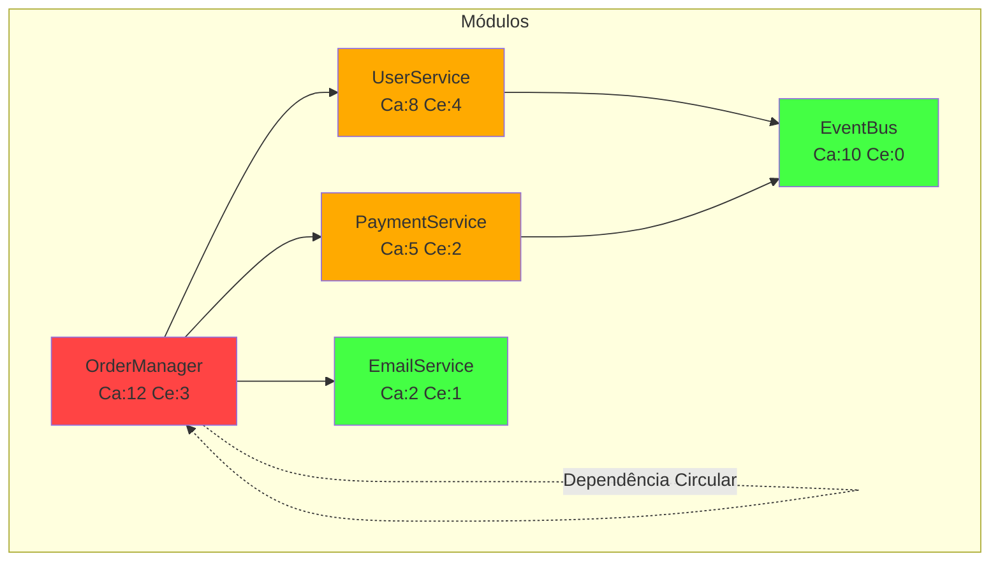

# Skill: Coupling Detector

> Detecção e análise de acoplamento excessivo entre módulos para guiar desacoplamento e melhorar manutenibilidade

---

## 🎯 Objetivo

Medir o acoplamento entre módulos, classes e pacotes do sistema usando métricas objetivas (afferent/efferent coupling, instabilidade, abstractness), identificar dependências problemáticas (circulares, excessivas, inadequadas) e recomendar estratégias de desacoplamento.

---

## 🔁 Gatilhos de Acionamento

- Análise de arquitetura de projeto
- Antes de grande refatoração
- Suspeita de acoplamento excessivo
- Dificuldade para testar módulos isoladamente
- Solicitação de "meça o acoplamento deste módulo"

---

## 📋 Processo de 4 Passos

### PASSO 1: CALCULAR MÉTRICAS DE ACOPLAMENTO

**Objetivo:** Medir objetivamente o acoplamento de cada módulo

**Ações:**
1. **Afferent Coupling (Ca):** Quantas classes externas dependem desta classe
2. **Efferent Coupling (Ce):** De quantas classes externas esta classe depende
3. **Instabilidade (I):** I = Ce / (Ca + Ce). 0 = estável, 1 = instável
4. **Abstractness (A):** Proporção de classes abstratas/interfaces no pacote
5. **Distância da Sequência Principal (D):** D = |A + I - 1|. Ideal = 0

**Output:**
```markdown
## Métricas de Acoplamento

### Por Módulo

| Módulo | Ca | Ce | I (Instab.) | A (Abstr.) | D (Dist.) | Status |
|--------|----|----|-------------|-------------|-----------|--------|
| OrderManager | 12 | 3 | 0.20 | 0.00 | 0.80 | 🔴 |
| PaymentService | 5 | 2 | 0.29 | 0.33 | 0.38 | ⚠️ |
| UserService | 8 | 4 | 0.33 | 0.25 | 0.42 | ⚠️ |
| EmailService | 2 | 1 | 0.33 | 0.50 | 0.17 | ✅ |
| EventBus | 10 | 0 | 0.00 | 0.80 | 0.20 | ✅ |

### Interpretação
- **Ca alto + I baixo =** Módulo muito dependido (estável) → OrdemManager é central
- **Ce alto + I alto =** Módulo muito dependente (instável) → Frágil
- **D próximo de 0 =** Zona da sequência principal (ideal)
- **D próximo de 1 =** Zona de sofrimento ou inutilidade

### Diagrama de Acoplamento

---

### PASSO 2: IDENTIFICAR DEPENDÊNCIAS PROBLEMÁTICAS

**Objetivo:** Encontrar padrões específicos de acoplamento prejudicial

**Ações:**
1. **Dependências Circulares:** A → B → A
2. **Feature Envy:** Classe que usa muitos métodos de outra
3. **Inappropriate Intimacy:** Classes muito acopladas
4. **Message Chains:** a.getB().getC().doSomething()
5. **Middle Man:** Classe que só delega para outra
6. **Hub-Like Dependency:** Módulo central que todos dependem

**Output:**
```markdown
## Dependências Problemáticas

### Circular: OrderManager → UserService → OrderManager
```
OrderManager.getOrder() → UserService.getUser() → OrderManager.getOrder()
```
**Impacto:** Não é possível testar OrderManager sem UserService e vice-versa
**Recomendação:** Extrair dependência compartilhada para OrderContext

### Feature Envy: OrderManager.calculateTotal()
```typescript
class OrderManager {
  calculateTotal(order: Order) {
    // Usa 8 métodos de Order, 0 de OrderManager
    return order.getItems()
      .map(i => i.getPrice() * i.getQuantity())
      .reduce((a, b) => a + b);
  }
}
```
**Recomendação:** Mover para Order.calculateTotal()

### Hub Dependency: OrderManager
**12 classes dependem de OrderManager**
- Qualquer mudança em OrderManager afeta 12 clientes
- Teste de OrderManager requer setup de 12 dependências
- **Recomendação:** Extrair interfaces e aplicar Dependency Inversion

### Message Chain: 4 níveis
```typescript
// Em vários lugares do código
order.getUser().getAddress().getCity().getShippingRate();
```
**Recomendação:** Law of Demeter - criar método direto em Order
```

---

### PASSO 3: CALCULAR IMPACTO DE MUDANÇAS

**Objetivo:** Estimar quanto esforço uma mudança em cada módulo exigiria

**Ações:**
1. **Ripple Effect:** Quantas classes precisam mudar se X mudar
2. **Test Impact:** Quantos testes quebram se X mudar
3. **Change Frequency:** Quantas vezes X mudou nos últimos 30 dias
4. **Risk Score:** Impacto × Frequência × Acoplamento

**Output:**
```markdown
## Análise de Impacto de Mudanças

| Módulo | Ripple Effect | Test Impact | Change Freq | Risk Score |
|--------|--------------|-------------|-------------|------------|
| OrderManager | 12 classes | 45 testes | 15x/mês | 🔴 810 |
| UserService | 8 classes | 30 testes | 8x/mês | ⚠️ 192 |
| PaymentService | 5 classes | 20 testes | 3x/mês | 🟡 30 |
| EmailService | 2 classes | 8 testes | 1x/mês | 🟢 2 |
| EventBus | 10 classes | 25 testes | 2x/mês | 🟡 50 |

### Módulos de Alto Risco (Prioridade de Refatoração)

1. **OrderManager** - Risco 810 🔴
   - Cada mudança afeta 12 módulos
   - Muda 15 vezes por mês
   - Sem abstração (interfaces)

2. **UserService** - Risco 192 ⚠️
   - Acoplamento circular com OrderManager
   - Dependência bidirecional
```

---

### PASSO 4: RECOMENDAR ESTRATÉGIAS DE DESACOPLAMENTO

**Objetivo:** Propor técnicas específicas para reduzir acoplamento

**Ações:**
1. **Dependency Inversion:** Depender de abstrações, não de concretos
2. **Interface Segregation:** Interfaces específicas para cada cliente
3. **Event-Driven:** Comunicação assíncrona via EventBus
4. **Facade:** Interface simplificada ocultando complexidade
5. **Mediator:** Centralizar comunicação complexa
6. **Strategy:** Substituir condicionais por estratégias intercambiáveis

**Output:**
```markdown
## Recomendações de Desacoplamento

### Prioridade Alta (impacto imediato)

#### 1. Aplicar Dependency Inversion em OrderManager

**Antes:**
```typescript
class OrderManager {
  private userService = new UserService();
  private paymentService = new PaymentService();
  private emailService = new EmailService();
}
```

**Depois:**
```typescript
interface OrderRepository { getOrder(id: string): Order; }
interface PaymentGateway { process(order: Order): PaymentResult; }
interface NotificationService { send(order: Order): void; }

class OrderManager {
  constructor(
    private orders: OrderRepository,
    private payment: PaymentGateway,
    private notification: NotificationService
  ) {}
}
```

**Redução:** Acoplamento direto de 3 para 0 (depende de interfaces)

#### 2. Extrair Facades

**Criar OrderFacade:**
```typescript
// Facade unifica operações de OrderManager
class OrderFacade {
  constructor(
    private orderManager: OrderManager,
    private userService: UserService
  ) {}

  async placeOrder(userId: string, items: OrderItem[]) {
    const user = await this.userService.getUser(userId);
    return this.orderManager.createOrder(user, items);
  }
}
```

### Prioridade Média (planejamento)

| Sugestão | Técnica | Benefício | Esforço |
|----------|---------|-----------|---------|
| EventBus para notificações | Event-Driven | OrderManager não precisa conhecer notificadores | 4h |
| Interface para OrderRepository | Interface Segregation | Múltiplos storages (mock, sql, nosql) | 2h |
| Mediator para Order workflow | Mediator | Centraliza orquestração complexa | 6h |

### Plano de Ação Sugerido
```
Semana 1: Aplicar Dependency Inversion (OrderManager)
Semana 2: Extrair OrderFacade
Semana 3: Migrar notificações para EventBus
Semana 4: Quebrar dependência circular OrderManager ↔ UserService
```
```

---

## 💻 Exemplo de Prompt

```
Analise o acoplamento do módulo OrderManager. Calcule Ca, Ce, I e D.
Identifique dependências circulares, feature envy e message chains.
Calcule o ripple effect de uma mudança em OrderManager.
Recomende 3 estratégias de desacoplamento com exemplos de código.

Código fonte em: src/services/order-manager.ts
```

---

## ✅ Métricas de Sucesso

| Métrica | Alvo | Como Medir |
|---------|------|------------|
| Instabilidade (I) ideal | 0.3-0.7 para módulos centrais | Métrica calculada |
| Distância (D) principal | < 0.3 | Métrica calculada |
| Dependências circulares | Zero | Grafo de dependências |
| Ripple effect médio | < 5 classes | Análise de impacto |
| Feature envy detectado | < 5 ocorrências | Scanner automático |
| Message chains | < 3 níveis | Deep source analysis |

---

## 🔗 Integrações

### Acionado Por
- `architecture-analyzer` (durante análise arquitetural)
- `pattern-matcher` (aprofundar detecção de anti-patterns)
- `tech-lead` (code review de arquitetura)
- `architect` (planejamento de desacoplamento)

### Aciona
- `modularity-optimizer` (otimizar modularidade)
- `refactoring-advisor` (recomendar refatorações)
- `adr-generator` (documentar decisões de desacoplamento)
- `complexity-analyzer` (métrica de complexidade)

### Registra Em
- `.ai-factory/logs/architecture-analysis/COUPLING-YYYY-MM-DD.json`
- `.ai-factory/MELHORIAS/INDEX.md`

---

**Versão:** 1.0.0  
**Universal:** Sim (aplicável a qualquer linguagem OOP)  
**Tempo Médio:** 2-4h por projeto  
**Taxa de Sucesso:** >85% (recomendações implementadas)
