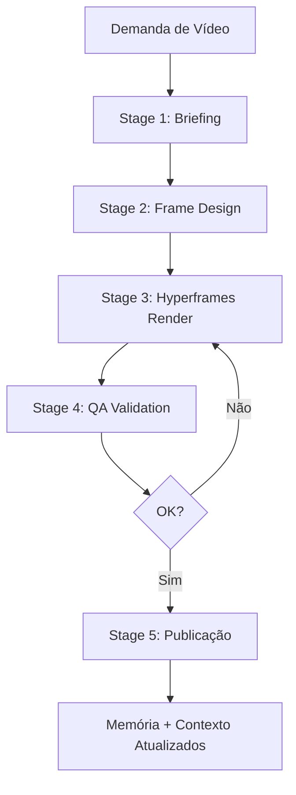

# Workflow: Criar Vídeo de Demo / Marketing

## Trigger
Demanda de vídeo para demo de produto, walkthrough de feature, explainer ou motion graphic

## Stage 1 - Briefing
**Agente:** product-marketer ou tech-lead (via `/lider`)

**Input:**
- descricao do produto/feature
- URL do projeto ou especificação
- tipo de vídeo (product-launch, explainer, PR-to-video, motion-graphic)

**Output:**
- `assets/videos/[nome]/brief.md` — Briefing criativo (público-alvo, tom, duração, CTA)

**Gate:**
- [ ] Tipo de vídeo definido
- [ ] Público-alvo identificado
- [ ] Duração estimada acordada

**Se falhar:** Refinar com stakeholder

---

## Stage 2 - Design (Frame)
**Agente:** designer ou frontend-dev

**Input:**
- `assets/videos/[nome]/brief.md`

**Output:**
- `assets/videos/[nome]/frame.md` — Frame de design (paleta, tipografia, grid, resolução)

**Conteúdo mínimo de `frame.md`:**
```markdown
# Frame.md — [Nome do Projeto]

## Canvas
- Resolução: 1920x1080
- Frame rate: 30fps
- Duração: 30s

## Paleta
- Primary: #HEX
- Secondary: #HEX
- Background: #HEX
- Text: #HEX

## Tipografia
- Display: "Font Name"
- Body: "Font Name"
```

**Gate:**
- [ ] frame.md salvo
- [ ] Resolução + paleta + tipografia definidas

---

## Stage 3 - Renderização
**Agente:** executor (delega para Hyperframes)

**Input:**
- `assets/videos/[nome]/frame.md`
- `skills/hyperframes/SKILL.md`

**Comandos:**

```bash
# 1. Iniciar projeto Hyperframes no diretório de assets
npx hyperframes init assets/videos/[nome]
Set-Location -LiteralPath "assets/videos/[nome]"

# 2. Escrever index.html com composição (HTML + data-* attributes + animações)

# 3. Preview visual
npx hyperframes preview

# 4. Renderizar vídeo
npx hyperframes render
```

**Output:**
- `assets/videos/[nome]/index.html` — Composição fonte
- `assets/videos/[nome]/output.mp4` — Vídeo renderizado

**Gate:**
- [ ] `preview` visual OK
- [ ] `render` concluído sem erros
- [ ] `output.mp4` gerado com duração esperada

**Se falhar:** Verificar pacotes (`npm install`), sintaxe HTML/data-* attributes, FFmpeg instalado

---

## Stage 4 - Validação
**Agente:** qa-tester

**Input:**
- `assets/videos/[nome]/output.mp4`
- `assets/videos/[nome]/brief.md`

**Validação:**
- [ ] Duração dentro do esperado (+/- 2s)
- [ ] Áudio sincronizado (se houver)
- [ ] Resolução correta (1920x1080 ou especificada)
- [ ] Cores e fontes conforme frame.md
- [ ] Textos sem erros de digitação

**Output:**
- `assets/videos/[nome]/qa-report.md`

**Gate:**
- [ ] Zero blocker issues
- [ ] 100% critérios validados

**Se falhar:** Voltar Stage 3 com `fixes/` no brief

---

## Stage 5 - Publicação
**Agente:** product-marketer

**Input:**
- `assets/videos/[nome]/output.mp4`

**Ações:**
- Registrar vídeo na memória
- Referenciar em materiais de marketing (landing page, social media, etc.)

```bash
# Registrar na memória do NexusAuto
node .ai-factory/scripts/memory-manager.js save \
  "Vídeo gerado em assets/videos/[nome]/output.mp4" \
  --agent product-marketer --type general --tags video,hyperframes,demo
```

**Gate:**
- [ ] Memória atualizada
- [ ] Output distribuível (MP4)

---

## Pós-Workflow
- [ ] Atualizar `PROGRESS.md`
- [ ] Atualizar `PROJECT_CONTEXT.md`
- [ ] Adicionar aprendizado no workflow (se houver)

## Visualização do Fluxo



## Exemplo: Vídeo de Lançamento de Feature

```bash
# 1. Tech Lead identifica necessidade via /lider
# 2. Product Marketer cria brief:
#    assets/videos/payment-feature/brief.md
# 3. Designer cria frame:
#    assets/videos/payment-feature/frame.md
# 4. Executor renderiza:
cd assets/videos/payment-feature
npx hyperframes init .
# edita index.html com transição de telas do checkout
npx hyperframes render
# 5. QA valida
# 6. Product Marketer publica
```

## Troubleshooting

### Hyperframes não encontrado
```bash
npx hyperframes init test
# Se falhar: npm install -g hyperframes
```

### FFmpeg não encontrado
```bash
winget install FFmpeg
# ou: choco install ffmpeg
```

### Render falha silenciosamente
Verificar:
- `data-composition-id` corresponde ao usado no JS `__timelines`
- `class="clip"` presente nos elementos visíveis
- `data-track-index` sem gaps
- `data-start + data-duration` não excede duração total
