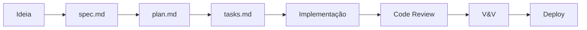

# Contribuindo com o NexusAuto

## Como Adicionar um Novo Agente

### 1. Crie o arquivo de definição

```markdown
.ai-factory/agents/seu-agente.md
```

Use o template em `.ai-factory/bases/agent-template.md`.

### 2. Estrutura recomendada

```
.ai-factory/agents/seu-agente.md     → Definição do agente (persona, skills, handoffs)
.ai-factory/skills/seu-agente/       → Skills específicas (opcional)
```

### 3. Checklist de criação

- [ ] Nome, especialidade e status no frontmatter
- [ ] Responsabilidades claras e mensuráveis
- [ ] Skills vinculadas (usando `[[skills/...]]`)
- [ ] Handoffs definidos (entrada/saída)
- [ ] Matriz de roteamento atualizada (COMO-USAR.md)
- [ ] Testado com ao menos 1 tarefa real

## Padrões de Código

| Convenção | Regra |
|-----------|-------|
| Nomes | `snake_case` para arquivos, `camelCase` para funções JS/TS |
| Commits | [Conventional Commits](https://www.conventionalcommits.org/): `feat:`, `fix:`, `chore:`, `docs:`, `refactor:`, `test:` |
| Branches | `feature/[nome]`, `fix/[nome]`, `hotfix/[nome]` |
| .env | Sempre documentar no `.env.example` com comentário do propósito |
| README | Usar template em `.github/README_TEMPLATE.md` para módulos |
| PRs | Usar template em `.github/PULL_REQUEST_TEMPLATE.md` |

## Fluxo de Desenvolvimento



### Spec-Driven Development

Toda feature DEVE seguir:

1. `specs/[feature]/spec.md` — O QUE construir
2. `specs/[feature]/plan.md` — COMO construir
3. `specs/[feature]/tasks.md` — Lista de tarefas
4. `specs/[feature]/clarifications.md` — Esclarecimentos

## Validação & Verificação (V&V)

Após CADA alteração:

1. Lint passando (`npm run lint` ou equivalente)
2. Tipos checados (`npm run typecheck` ou `tsc --noEmit`)
3. Testes passando (`npm test` ou equivalente)
4. Build limpo (`npm run build`)
5. Segurança verificada (sem secrets expostos)
6. Spec vinculada (se aplicável)
7. Commit seguindo conventional commits

## Ambiente

1. Copie `.env.example` para `.env`
2. Preencha as variáveis obrigatórias
3. Consulte `.github/ENV-GUIDE.md` para detalhes
